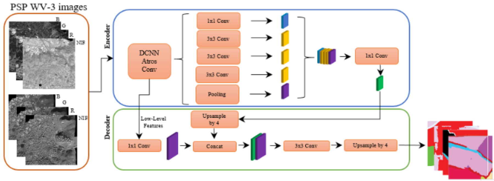
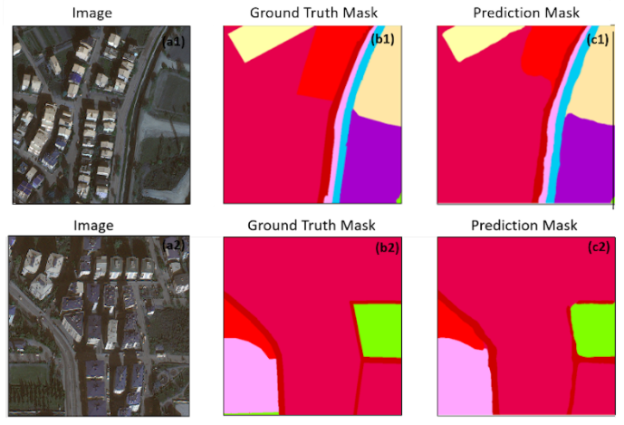

# Land Use and Land Cover Mapping Using Deep Learning Based Segmentation Approaches and VHR Worldview-3 Images
This repository contains the code for the paper [Land Use and Land Cover Mapping Using Deep Learning Based Segmentation Approaches and VHR Worldview-3 Images]([PLACEHOLDER])

Aim
---------------------

In this research, we generated a new benchmark dataset from VHR Worldview-3 images for twelve different LULC classes of two different geographical locations. We evaluated the performance of different segmentation architectures and encoders to find out the best solution to create highly accurate LULC maps. 

Framework
---------------------
The framework of this study is detailed as follow. 

LULC classes used in this study
----------------------

Sample Outputs
---------------------

Dataset and Weights
---------------------
| Dataset            | Model | F-1 Score | IoU | Weights |
|:--------------------------:|:------------------:|-------------------------:|-------------------------:| -------------------------:|
|Aksu                       | DeepLabv3+ Resnext-50_32x_4d             | 94.35  | 89.46 |[weights](https://drive.google.com/drive/u/0/folders/1DdH4eiUFgtX3iOjkM-pu6DknOgtg1GAL)                   |
|Kestel                         | DeepLabv3+ Resnext-50_32x_4d                | 89.65  | 89.76 |[weights](https://drive.google.com/drive/u/0/folders/1DdH4eiUFgtX3iOjkM-pu6DknOgtg1GAL)                 |
|Aksu + Kestel Combined                       | DeepLabv3+ Resnext-50_32x_4d                 | 92.85  | 92.83 |[weights](https://drive.google.com/drive/u/0/folders/1DdH4eiUFgtX3iOjkM-pu6DknOgtg1GAL)   

The dataset and the weights can be found [here](https://drive.google.com/drive/folders/1a2FPc1-itu1V9_Q4n9aaWB4GV9MGeOqh?usp=sharing).

System-specific notes
---------------------
The code was implemented in Python(3.8) and PyTroch(1.14.0) on Windows OS. The *segmentation models pytorch* library is used as a baseline for implementation. Apart from main data science libraries, RS-specific libraries such as GDAL, rasterio, and tifffile are also required.

Citation
---------------------
Please kindly cite our paper if this code and the dataset used in the study is useful for your research.

Sertel, E.; Ekim, B.; Ettehadi Osgouei, P.; Kabadayi, M.E. Land Use and Land Cover Mapping Using Deep Learning Based Segmentation Approaches and VHR Worldview-3 Images. Remote Sens. 2022, 14, 4558. https://doi.org/10.3390/rs14184558
